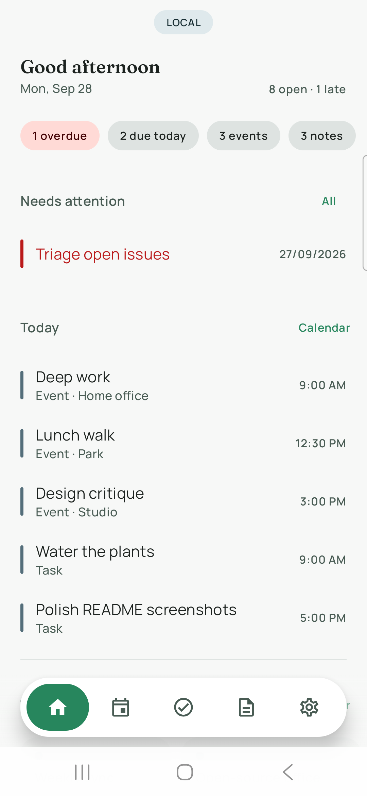
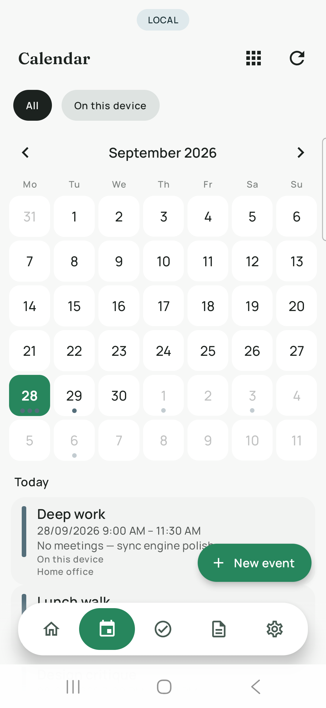
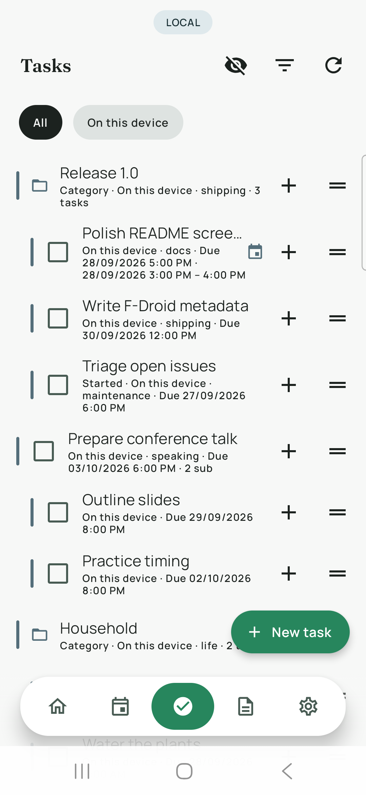
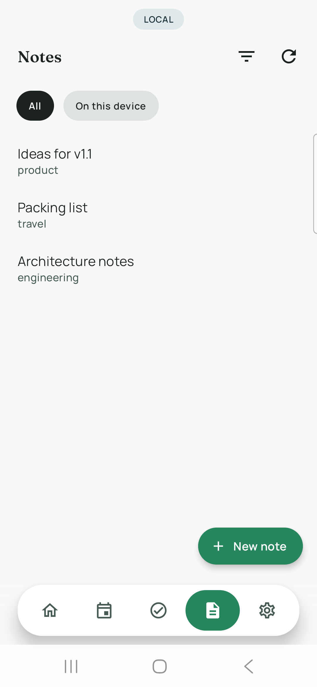
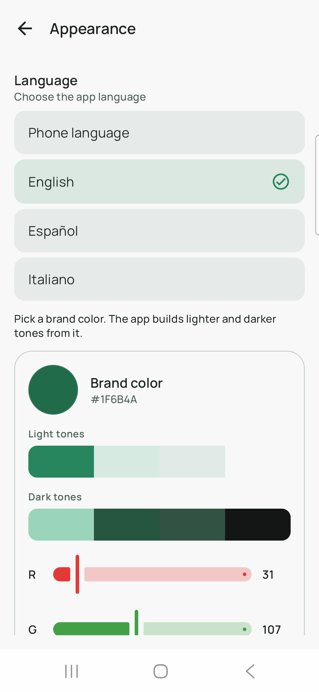
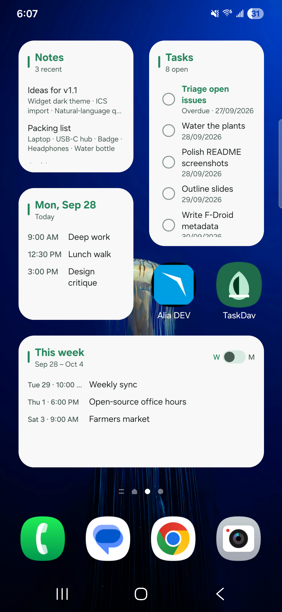

# TaskDav

**Tasks, notes, and a calendar that sync over CalDAV — or stay on the device.**

TaskDav is a free and open-source Android app for people who want their planning data on a server they control (Radicale, Nextcloud, Baïkal, …), without Google Play Services, analytics, or ads. It works fine next to [DAVx⁵](https://www.davx5.com/) on the same account.

[](LICENSE)
[](#requirements)
[](https://github.com/TechPonzo/TaskDav/actions/workflows/ci.yml)
[](CONTRIBUTING.md)

<p align="center">
  
  
  
  
  
</p>

<p align="center">
  
</p>

<p align="center"><em>Home-screen widgets for notes, tasks, today’s events, and a week/month agenda.</em></p>

## Why TaskDav?

Most “productivity” apps want a proprietary cloud. TaskDav speaks plain CalDAV:

- **Your server, your data** — credentials stay encrypted on the phone; nothing is sent to the TaskDav authors
- **Local-only mode** — use it without any account until you are ready to sync
- **Works with the FOSS stack** — designed to coexist with DAVx⁵ and other CalDAV clients
- **No Play Services** — suitable for GrapheneOS, LineageOS, and F-Droid-style installs

## Features

- Offline-first tasks (`VTODO`), notes (`VJOURNAL`), and events (`VEVENT`) with Room + WorkManager sync
- Nested tasks and nestable categories (`RELATED-TO` / `X-TASKDAV-KIND:CATEGORY`)
- Tags (`CATEGORIES`), due dates, priorities, and optional linked calendar events
- Weekly recurrence for events (`RRULE`)
- Home dashboard: overdue, due today, today’s agenda, recent notes
- Calendar views (day / week / month / year / list)
- Themes from a single brand color; UI in **English**, **Spanish**, and **Italian**
- Home-screen widgets for today, week/month agenda, tasks, and notes (plus a compact agenda size)
- Share tasks, events, or notes as text + `.ics`; export collections
- Optional mirror / import with the phone calendar (`CalendarContract`)
- Handles “add event” / ICS intents so TaskDav can be a calendar target

## Install

### From source (debug)

```bash
export JAVA_HOME=$(/usr/libexec/java_home -v 21)   # JDK 17+
export ANDROID_HOME=~/Library/Android/sdk

./gradlew assembleDebug
adb install -r app/build/outputs/apk/debug/app-debug.apk
```

### Stores

TaskDav is intended for **F-Droid** and similar free-software catalogs. Store listing text and screenshots live under [`fastlane/metadata/android/`](fastlane/metadata/android/) (EN / ES / IT). A draft fdroiddata recipe is in [`metadata/app.taskdav.yml`](metadata/app.taskdav.yml) — copy it into an [fdroiddata](https://gitlab.com/fdroid/fdroiddata) fork as `metadata/app.taskdav.yml` and open a merge request. Links will be added here once the package is published.

### Release build (minified)

```bash
./gradlew assembleRelease -PuseDebugKeystore
# APK: app/build/outputs/apk/release/app-release.apk
```

Release uses R8 minify + resource shrinking. F-Droid builds from source and signs with their own key.

## Quick start

1. Open the app → finish onboarding (or skip) — you land in **local-only** mode with an on-device calendar.
2. To sync: **Settings → Syncing → CalDAV** → base URL, username, password → **Save & discover** → enable collections → sync.
3. Optional: keep DAVx⁵ for contacts/calendars; TaskDav talks to the server itself for tasks, notes, and its own events.

### Radicale collection example

```bash
curl -u USER:PASS -X MKCOL 'https://caldav.example/USER/tasks/' --data \
'<?xml version="1.0" encoding="UTF-8" ?>
<create xmlns="DAV:" xmlns:C="urn:ietf:params:xml:ns:caldav" xmlns:I="http://apple.com/ns/ical/">
  <set>
    <prop>
      <resourcetype>
        <collection />
        <C:calendar />
      </resourcetype>
      <C:supported-calendar-component-set>
        <C:comp name="VEVENT" />
        <C:comp name="VTODO" />
        <C:comp name="VJOURNAL" />
      </C:supported-calendar-component-set>
      <displayname>Tasks</displayname>
      <I:calendar-color>#2B6A4FFF</I:calendar-color>
    </prop>
  </set>
</create>'
```

Use a base URL like `https://host:5232/USER/` in TaskDav.

## Privacy

- Account credentials live in **encrypted preferences** on the device
- Tasks, notes, and events live in a **local database** and are sent only to the CalDAV server you configure
- No analytics, crash-reporting SDKs, ads, or Google Play Services
- Uninstall or clear app data to remove the local copy

See **Settings → Privacy** in the app for the full notice.

## Architecture (short)

| Area | Role |
|------|------|
| `caldav/` | OkHttp + dav4jvm, PROPFIND/REPORT/PUT/DELETE, ical4j |
| `data/` | Room, encrypted account prefs, locale / appearance |
| `domain/` | Task tree, repository, sync orchestration |
| `sync/` | WorkManager periodic + reconnect push |
| `ui/` | Home, Calendar, Tasks, Notes, Settings |
| `widget/` | Glance home-screen widgets |

## Requirements

- Android 8.0+ (API 26)
- Optional: a CalDAV server advertising `VTODO` (and optionally `VEVENT` / `VJOURNAL`)
- JDK 17+ to build

## Limitations

- No DAVx⁵ ContentProvider integration (TaskDav syncs over CalDAV itself)
- Recurring events: series edits only (no single-occurrence exceptions yet)
- Recurring tasks are not edited in-app (existing `RRULE`s may be preserved on rewrite when possible)

## Contributing

Pull requests and issues are welcome. See **[CONTRIBUTING.md](CONTRIBUTING.md)** for the branch model and PR checklist.

**Short version**

| Branch | Use for |
|--------|---------|
| `main` | Stable / releases |
| `develop` | Next release integration |
| `feature/…`, `fix/…` | Your work → PR into `develop` |

```bash
git checkout develop
git pull
git checkout -b feature/my-change
# … commit …
# open a PR targeting develop
```

Useful entry points: `app/src/main/java/app/taskdav/`, string catalogs under `app/src/main/res/values*/strings.xml`.

Debug builds include a demo seeder for screenshots:

```bash
adb shell am broadcast -n app.taskdav/.debug.DemoSeedReceiver -a app.taskdav.debug.SEED_DEMO
./scripts/capture-screenshots.sh
```

## License

TaskDav is free software under the [GNU General Public License v3.0](LICENSE).

Third-party libraries keep their own licenses — see **Settings → Credits** in the app.
